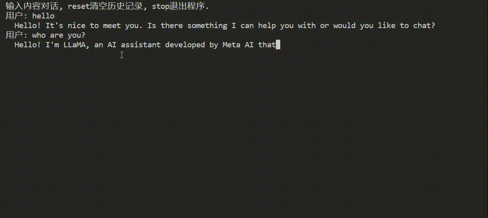

## Introduction



llama2推理加速库，基于[fastllm](https://github.com/ztxz16/fastllm)进行了二次开发。
在4090单卡上llama2-7b（FP16）推理速度可达166+ tokens/s。

支持以下特性：

✅ MHA

✅ KV Cache：动态扩容、量化

✅ Iteration Level的调度

✅ RoPE

✅ W8A8量化

✅ 高性能算子：GPU、CPU

✅ BPE编码

✅ 流式对话

无第三方依赖，代码结构清晰。

## 性能测试
```bash
# MAX OUTPUT LEN = 512, INPUT LEN = Repeat([5, 13, 27, 51])
./benchmark_batch --weight /pathto/llama2_7b_chat.bin --token /pathto/tokenizer.bin --file ../benchmark/prompts.txt -t 32 -l 512
```

| 吞吐（tokens/s） | 1581       |
| ---------------- | --------- |
| 模型             | llama2-7B |
| 精度             | FP16      |
| GPU              | 4090      |
| 显存（G）        | 24        |
| batch_size       | 72        |

```bash
# sample from shareGPT, input length range from to 13 to 900
./benchmark_batch --weight /pathto/llama2_7b_chat.bin --token /pathto/tokenizer.bin --file ../benchmark/shareGPT_sample.txt -t 32 -l 1024
```

| 吞吐（tokens/s） | 166       |
| ---------------- | --------- |
| 模型             | llama2-7B |
| 精度             | FP16      |
| GPU              | 4090      |
| 显存（G）        | 24        |
| batch_size       | 12        |


## 快速开始
1. 导出模型

```bash
git clone https://github.com/bjmsong/xLLM.git
cd xLLM
conda create --name xllm
conda activate xllm
pip install -r scripts/requirements.txt
huggingface-cli login
python scripts/export_weight.py /pathto/cache /pathto/llama2_7b_chat.bin
python scripts/export_tokenizer.py /pathto/tokenizer.bin
```

2.  编译
```bash
# 使用GPU
mkdir build-cuda && cd build-cuda
cmake .. -DUSE_CUDA=ON -DCUDA_ARCHITECTURES=75
make -j4

# 不使用GPU
mkdir build && cd build
cmake ..
make -j4
```

3. 运行
```bash
./main --weight /pathto/llama2_7b_chat.bin --token /pathto/tokenizer.bin --threads 32
```


## 显存占用分析(以llama2-7B为例)
| 参数名                              | 缩写 | 参数值 |
| ----------------------------------- | ---- | ------ |
| vocab_size                          | v    | 32000  |
| batch_size                          | b    | 48     |
| max input sequence length           | s    | 68     |
| max output sequence length          | n    | 512    |
| hidden dimension of the transformer | h1   | 4096   |
| hidden dimension of the second MLP  | h2   | 11008  |
| total number of transformer blocks  | L    | 32A    |

|              |                    | 参数量                        | 数据类型 | 内存（G） |
| ------------ | ------------------ | ----------------------------- | -------- | --------- |
| Embedding    |                    | vh1                           | FP32     | 0.5       |
| 模型权重     |                    | (4h1h1+2h1 + 3h1h2)L + vh1+h1 | FP16     | 12.3      |
|              | **self-attention** | (4h1h1+h1)L                   | FP16     | 4         |
|              | **MLP**            | (3h1h2+h1)L                   | FP16     | 8.1       |
|              | head               | vh1+h1                        | FP16     | 0.2       |
| **KV cache** |                    | 2bh1L[(s+n)%128]*128          | FP32     | **30**    |
| 中间激活值   | prefill阶段        | bs(8h1+2h2+(s+n)+v)           | FP32     | 1.1       |
|              | decoding阶段       | b(8h1+2h2+(1+n)+v)            | FP32     | 0.02      |


## 性能瓶颈分析(以llama2-7B为例)
- 假设数据类型为fp16
- per token， per layer
- 4090
  - 计算能力(Half)：73 TFLOPs
  - 带宽：1008 GB/s

| 算子             | 计算量    | 访存量    | 计算量(GFLOPs) | 访存量(GB) | 计算时间(ms) | 访存时间(ms) | 瓶颈       |
| ---------------- | --------- | --------- | -------------- | ---------- | ------------ | ------------ | ---------- |
| Get k            | 2bh1h1    | 2h1h1     | 2.1            | 0.03       | 0.03         | 0.03         |            |
| attention score  | 2bh1(s+n) | 2bh1(s+n) | 0.5            | 0.5        | 0.007        | 0.5          | **memory** |
| attention output | 2bh1(n+s) | 2bh1(s+n) | 0.5            | 0.5        | 0.007        | 0.5          | **memory** |


## 量化
1. 导出INT8模型
```bash
./quant --weight llama2_7b_chat.bin -o llama2_7b_chat_int8.bin -b 8
```

2. 推理INT8模型
```bash
./main --weight /pathto/llama2_7b_chat_int8.bin --token /pathto/tokenizer.bin --threads 32
```


## 单元测试
```bash
cmake .. -DDEVELOPMENT=ON
make -j4

./tests/unittest --gtest_filter=test_operator.linear
```
